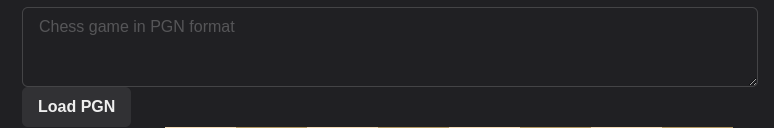
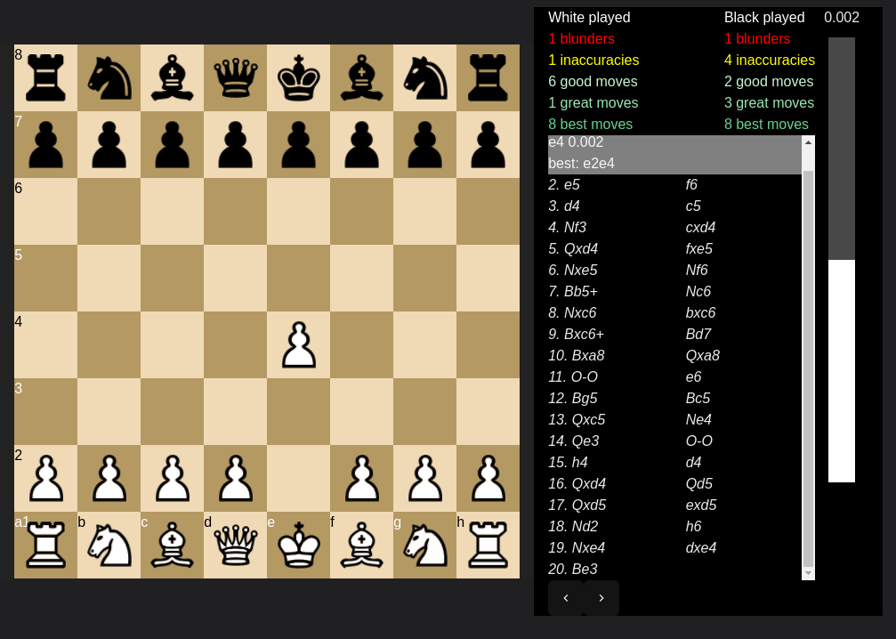

# Chess Analyser

[](https://github.com/The-Law-1/chess-analyzer/actions/workflows/buildDocker.yml)

## What is Chess Analyser ?

It is a small web application that allows you to analyse your chess games.

Using the <a href="https://stockfishchess.org/"> Stockfish Engine </a>, the website will provide a score and a best move for every move of the game.

It will also use the score descripancy between each move to evaluate if your move was good, or bad.

## How do I run it ?

Install Docker and Docker-Compose.

You will then need to create a .env file at the project root and provide a few environment variables:

SERVER_PORT=XXXX (The port you want the server to run on)

ENGINE_PATH=/usr/local/bin/stockfish (The path to a UCI engine in the container)

By default, the server image downloads Stockfish from the <a href="https://github.com/official-stockfish/Stockfish">official repository master branch </a> to:

`/usr/local/bin/stockfish`

So you can pop that path right in there.

CLIENT_PORT=XXXX (The port you want the client to run on)


Once you are set, just run the following command at the root of the repository:

`docker-compose up -d --build`

The client image is about 627MB and the server is about 388MB.

## How does it work ?

Copy and paste your game in <a href="https://en.wikipedia.org/wiki/Portable_Game_Notation#:~:text=Portable%20Game%20Notation%20(PGN)%20is,supported%20by%20most%20chess%20software."> PGN </a> format.




Once the server has loaded the game and analysed it successfully, you will find the moves in the section on the right.



Click on a move to jump to it. The chess board will update accordingly.

Above the analysis, you will find a small summary for each side.

A bar on the side will show the score over the course of the game. A positive score indicates a good position for white. And vice versa.

## Developers


Obviously this is a pretty shabby work, the UI/UX is pretty awful, so is most of the code. So feel free to fork this repository and add/fix stuff at your leisure.

### Client

To run the client locally, you need to provide a
<i>.env.local</i> file in the client directory.

This must contain an variable for the server port:

NEXT_PUBLIC_SERVER_PORT=XXXX

Then run
```
npm run dev
```
at the root of the client directory.

By default it runs on port 3000, this can be changed in the package.json.

<br/>

### Server

To run the server locally, you will need to provide a <i>.env.development.local</i> file in the server directory.

This must contain the following variables:

SERVER_PORT=XXXX (A port for the server to run on)

ENGINE_PATH=XXXX (A path to a UCI engine, you will need to download one https://stockfishchess.org/)

Then run
```
npm run start
```